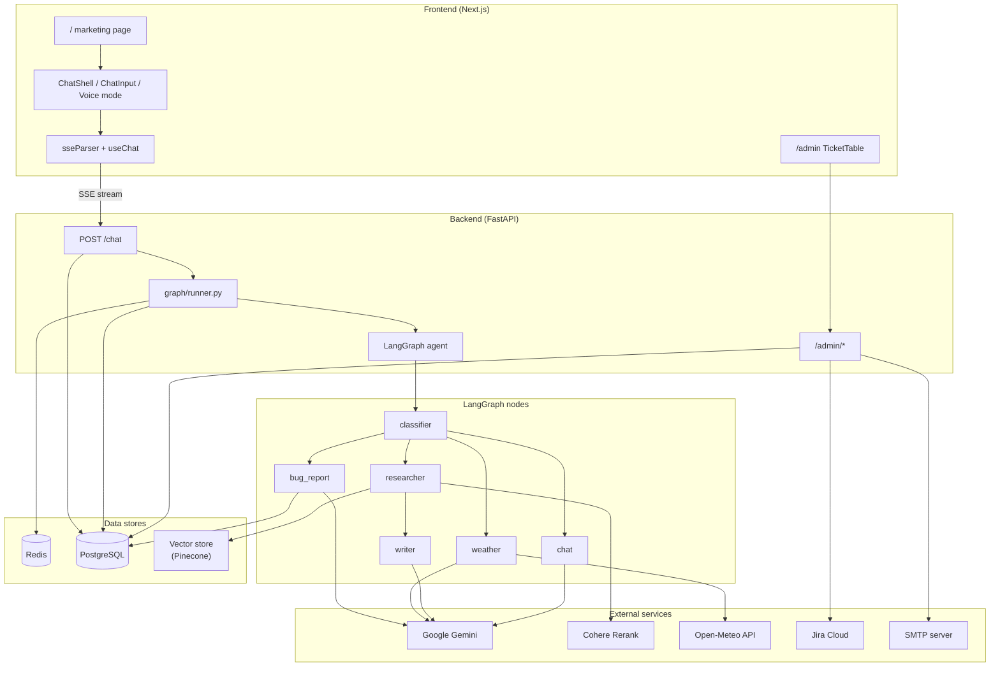
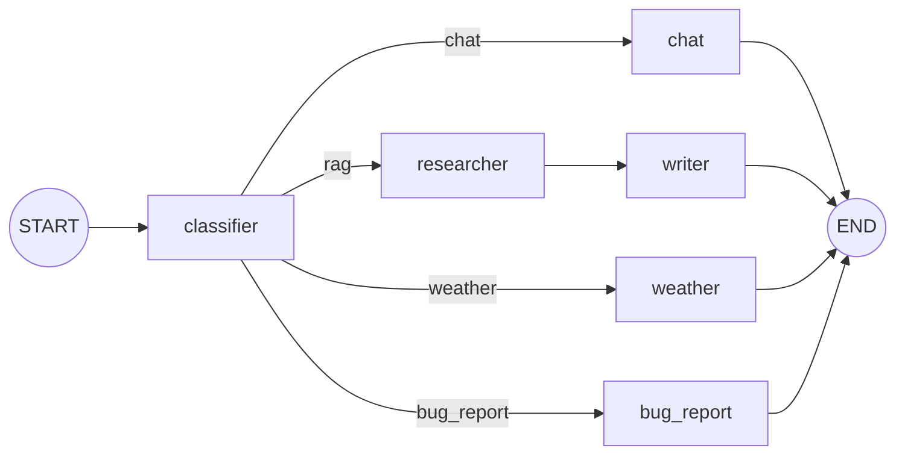
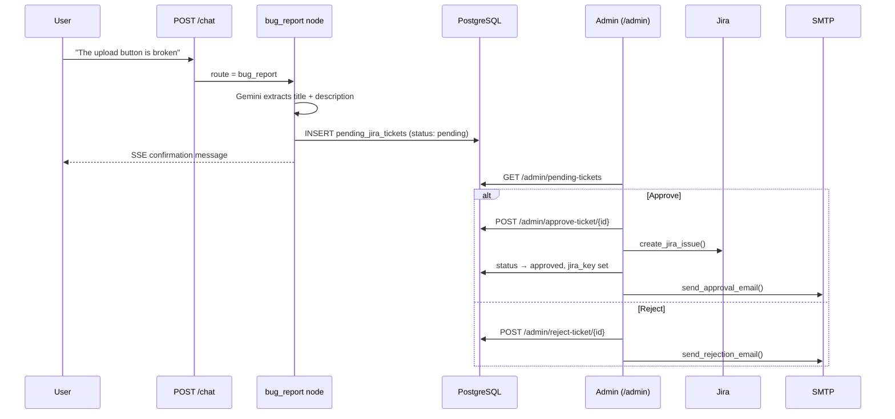
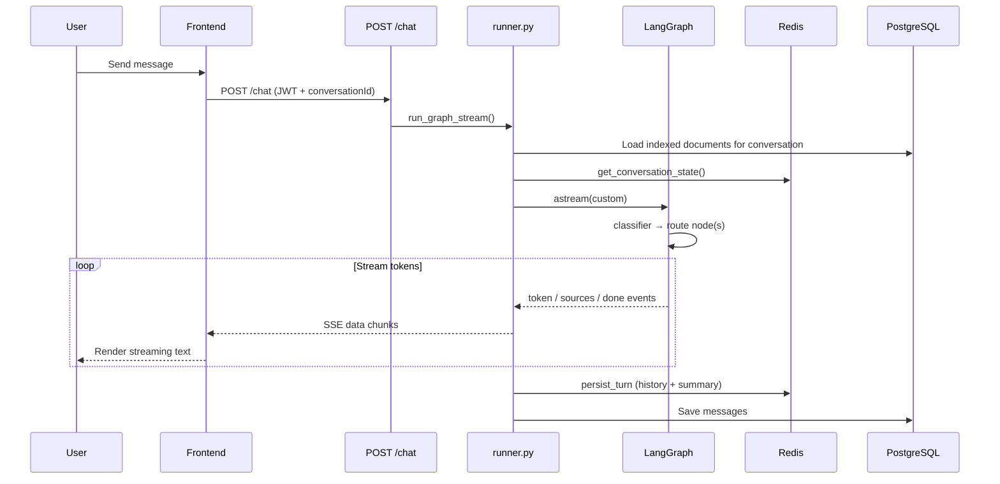
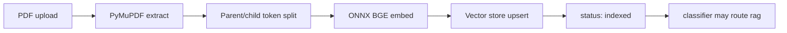

# Chatbot

A full-stack AI chatbot with **LangGraph intelligent routing**, document RAG, live weather, **bug-report triage**, and **Server-Sent Events (SSE)** streaming. Users authenticate via JWT, upload PDFs per conversation, and send all messages through a single `POST /chat` endpoint—the backend graph decides whether to chat generally, search documents, fetch weather, or draft a bug report for admin review.

## Documentation map

| README | Audience |
|--------|----------|
| [backend/README.md](backend/README.md) | FastAPI, LangGraph, RAG, Jira admin queue, migrations, services |
| [frontend/README.md](frontend/README.md) | Next.js UI, SSE client, auth, chat shell, admin dashboard |

## Introduction

This project is a production-style chat application. It demonstrates how to combine a modern web stack with agentic orchestration: instead of exposing separate endpoints for general chat, document Q&A, weather, and support tickets, the backend uses a **LangGraph state machine** to classify each user message and route it to the right capability.

From the user's perspective, the experience is a single chat thread. Upload a PDF, ask about the weather, report a broken feature, or have a casual conversation—the assistant responds in one stream. Behind the scenes, the graph loads conversation memory from Redis, checks which documents are indexed for the thread, classifies intent, runs retrieval or external APIs when needed, and streams tokens back over SSE.

Bug reports follow a human-in-the-loop workflow: the graph drafts a `pending_jira_tickets` row, an administrator approves or rejects it from `/admin`, and approved tickets are created in Jira with email notification to the reporter.

## Features

| Capability | Description |
|------------|-------------|
| **LangGraph orchestrator** | Classifier routes to `chat`, RAG (`researcher` → `writer`), `weather`, or `bug_report` |
| **Streaming SSE** | Token-by-token responses to the Next.js client |
| **Document RAG** | PDF upload, chunking, ONNX BGE embeddings (CPU execution), Pinecone vector store, Cohere reranking |
| **Weather** | Open-Meteo geocoding + forecast, grounded Gemini replies |
| **Bug reports** | Gemini extracts title/description → pending queue → admin approve/reject → Jira + SMTP email |
| **Admin dashboard** | Role-gated UI (`ticket:manage`) to review and action pending tickets |
| **Conversation memory** | Redis for hot history + summarization; Postgres for durable storage |
| **Auth** | JWT access tokens, httpOnly refresh cookies, OAuth2 scopes, RBAC permissions |
| **Marketing landing** | Public homepage with features, pricing, FAQ, and dark-mode support |
| **Voice mode** | Browser-native speech input/output (Chrome): Text/Voice toggle, startup yes/no prompt, 3s auto-send, TTS for AI replies |

## Tech stack

| Layer | Technologies |
|-------|--------------|
| **Frontend** | Next.js 16 (App Router), React 19, Tailwind CSS 4, TypeScript, SWR, Sonner, Web Speech API (voice mode) |
| **Backend** | FastAPI, SQLAlchemy 2 (async), Alembic, Pydantic Settings |
| **Orchestration** | LangGraph, LangChain Core runnables |
| **AI** | Google Gemini (`gemini-3.1-flash-lite`) — chat, classification, summarization, bug extraction |
| **RAG** | Pinecone vector store, local BGE-small ONNX (direct CPU inference via `onnxruntime` + `tokenizers`), Cohere Rerank v3 |
| **Integrations** | Jira Cloud REST API, SMTP (approval/rejection emails), Open-Meteo |
| **Cache** | Redis (`redis.asyncio`) — conversation history, summaries, rate limits |
| **Database** | PostgreSQL — users, sessions, conversations, messages, documents, pending tickets |
| **Documents** | PyMuPDF extraction, langchain-text-splitters, async background indexing |
| **Auth** | PyJWT, bcrypt, OAuth2 password flow, role/permission tables |
| **Container** | Multi-stage Docker images (`backend/Dockerfile`, `frontend/Chatbot/Dockerfile`) with uv / Node; orchestration via `docker-compose.yml` |

## System architecture



### Component responsibilities

| Component | Role |
|-----------|------|
| **Next.js client** | Auth, landing page, conversation sidebar, document panel, SSE consumption, admin ticket review |
| **`POST /chat`** | Ownership check, then delegates to `run_graph_stream()` |
| **`runner.py`** | Builds `AgentState`, runs `agent_graph.astream()`, maps custom events to SSE |
| **LangGraph** | Conditional routing across four intent paths |
| **`bug_report` node** | Extracts ticket fields via Gemini, inserts `pending_jira_tickets`, rate-limited per user |
| **`/admin/*`** | Lists pending tickets; approve creates Jira issue + email; reject notifies user |
| **Redis** | Hot message list, rolling summary, bug-report rate-limit keys |
| **Postgres** | Durable users, conversations, messages, document metadata, pending tickets |
| **Vector store** | `VectorStoreService` — Pinecone (managed); scoped by user + conversation document IDs |

## LangGraph routing

Every chat message enters the graph at the **classifier** node. The classifier picks one of four routes; the graph then runs the matching node chain and streams output via LangGraph's custom stream writer.



| Route | When it runs | Node path | Output |
|-------|--------------|-----------|--------|
| **chat** | General conversation, no document/weather/bug intent | `classifier` → `chat` → END | Gemini stream from user message + history |
| **rag** | Document-related intent and indexed PDFs exist | `classifier` → `researcher` → `writer` → END | Retrieve → rerank → grounded Gemini stream + source citations |
| **weather** | Weather keywords or location in message | `classifier` → `weather` → END | Open-Meteo fetch → Gemini conversational summary |
| **bug_report** | User reports errors, broken features, or app issues | `classifier` → `bug_report` → END | Draft Jira ticket in DB; user notified that admin will review |

### Classifier logic

1. **Regex fast-path** — `WEATHER_PATTERNS`, `BUG_PATTERNS`, and `RAG_PATTERNS` in `classifier.py` match common phrases without calling the LLM.
2. **Gemini structured classification** — When no rule matches, `classify_json()` returns a `RouteDecision` (`route` + `reason`).
3. **Hard guards** — RAG is downgraded to `chat` when the conversation has no indexed documents.

The frontend does not choose the route; it always calls `POST /chat`.

## Bug report and admin workflow



- **Rate limiting** — Redis key `rate_limit:bug_report:{user_id}` prevents spam (`BUG_REPORT_RATE_LIMIT_SECONDS`).
- **Permissions** — Admin endpoints require OAuth2 scope `ticket:manage` (assigned to the `admin` role in seed data).
- **Idempotency** — Row-level locking and `jira_key` checks prevent duplicate Jira issues on re-approval.

## End-to-end chat flow



### Custom stream events (graph → runner → SSE)

| Event | Payload | SSE mapping |
|-------|---------|-------------|
| `token` | `{ content }` | `{ success: true, data: { content } }` |
| `sources` | `{ sources }` | Buffered until final chunk |
| `done` | `{ prepared_messages, context_summary }` | Used for persistence after stream ends |

Final SSE chunk: `{ content: "", finishReason: "STOP", sources?: [...] }`.

## Document upload and RAG pipeline

Documents are scoped to a **conversation**. Upload triggers async indexing; the classifier only routes to RAG when documents reach `indexed` status.



Retrieval path (when routed to RAG):

1. **researcher** — embed query → vector store search → Cohere rerank → dedupe parent chunks → build grounded prompt.
2. **writer** — stream Gemini with grounded prompt; emit `sources` before `done`.

## Vector store

RAG indexing and retrieval go through `VectorStoreService` in `services/vector_store.py`. The backend is powered by **Pinecone** for document vector storage:

* **Pinecone** (`VECTOR_STORE_PROVIDER=pinecone`): Uses the native `AsyncPinecone` SDK. It automatically creates a serverless index (384-dimensional, cosine similarity) on startup if not present. Vectors are isolated by **`namespace = user_id`** to ensure tenant isolation.

Operations supported: `add_chunks`, `query`, and `delete_document` (scoped by conversation document IDs).

```env
VECTOR_STORE_PROVIDER=pinecone
PINECONE_API=your-pinecone-api-key
PINECONE_INDEX_NAME=documents
```

See [backend/README.md](backend/README.md) for full configuration and lifecycle details.

## Voice mode

The chat UI supports optional **Text** and **Voice** input modes using only browser-native APIs (no third-party voice service).

| Behavior | Detail |
|----------|--------|
| **Default mode** | Text |
| **Startup prompt** | On first load, the app asks *"Would you like to work in voice mode?"* and listens for yes/no |
| **Voice input** | Speech recognition from the message box; sends 3 seconds after speech ends |
| **Voice output** | AI responses are read aloud in Voice mode; a **Stop** control cancels playback |
| **Browser support** | Full voice input in **Chrome** (Web Speech API). Other browsers stay in Text mode with a clear notice |
| **No retroactive TTS** | Switching to Voice mode does not read previous messages—only replies to messages sent during the voice session |

Implementation lives in the frontend:

- `frontend/Chatbot/hooks/useVoiceMode.ts` — speech recognition, synthesis, debounced listen
- `frontend/Chatbot/lib/voice/speechRecognition.ts` — yes/no parsing, markdown stripping for TTS
- `frontend/Chatbot/components/chat/ChatShell.tsx` — mode state, startup prompt, auto-read gating
- `frontend/Chatbot/components/chat/ChatInput.tsx` — Text/Voice toggle and status UI

## Project structure

```
chatbot/
├── README.md                 # This file — system overview
├── docker-compose.yml        # Local full stack (Postgres, Redis, backend, optional frontend)
├── .dockerignore             # Root Docker build exclusions
├── backend/
│   ├── README.md             # Backend guide
│   ├── Dockerfile            # Multi-stage Python 3.14 image
│   └── app/                  # Python project root (uv, main.py, .env)
│       ├── api/routes/       # HTTP endpoints (chat, documents, admin)
│       ├── auth/             # JWT, scopes, refresh cookies, RBAC
│       ├── services/graph/   # LangGraph (classifier, nodes, runner)
│       └── services/         # Gemini, RAG, vector_store (Pinecone), Jira, email
└── frontend/
    ├── README.md             # Frontend guide
    └── Chatbot/              # Next.js App Router app
        ├── Dockerfile        # Multi-stage Node 24 image (next build + next start)
        ├── app/              # Pages (landing, login, register, chat, admin)
        ├── components/       # Chat UI, admin tables, marketing blocks
        ├── hooks/            # useChat, useVoiceMode, useAuth, …
        ├── lib/api/          # API clients + SSE parser
        └── lib/voice/        # Speech recognition helpers (voice mode)
```

## Prerequisites

| Service | Purpose |
|---------|---------|
| **PostgreSQL** | Users, conversations, messages, document metadata, refresh sessions, pending tickets |
| **Redis** | Conversation history cache, rolling summaries, rate limits |
| **Google Gemini API** | Chat, classification, summarization, bug extraction |
| **Cohere API** | Reranking for RAG retrieval |
| **Pinecone** | Managed vector store when `VECTOR_STORE_PROVIDER=pinecone` (`PINECONE_API`, index name) |
| **Jira Cloud** | Issue creation on ticket approval (`JIRA_*` env vars) |
| **SMTP** | Approval/rejection emails (optional but recommended) |

Required: local ONNX embedding model files placed at `backend/app/models/onnx/baai-bge-small` (must contain `model.onnx` and `tokenizer.json`).

## Quick start

### Backend

```bash
cd backend/app
uv sync
# Create .env — see backend/README.md
alembic upgrade head
python seed.py    # Seeds roles and permissions (admin role includes ticket:manage)
uv run fastapi dev main.py
```

- API docs: http://localhost:8000/docs  
- Health: http://localhost:8000/health/

### Frontend

```bash
cd frontend/Chatbot
npm install
# .env.local: NEXT_PUBLIC_API_URL=http://localhost:8000
npm run dev
```

Open http://localhost:3000 (marketing landing). Sign in at `/login`, then use `/chat`.

> **Build-time env:** `NEXT_PUBLIC_API_URL` is inlined at `npm run build`. For Docker or production, set it when building the frontend image—not only at container runtime.

### Docker Compose (full local stack)

Runs PostgreSQL, Redis, migrations, seed, backend, and optionally the frontend from the repo root:

```bash
# Create backend/app/.env first — see backend/README.md
docker compose --env-file ./backend/app/.env build backend
docker compose --env-file ./backend/app/.env up -d db redis
docker compose --env-file ./backend/app/.env run --rm migrate
docker compose --env-file ./backend/app/.env run --rm --no-deps seed
docker compose --env-file ./backend/app/.env up -d backend

# Optional: also run the Dockerized frontend (profile: local)
docker compose --env-file ./backend/app/.env --profile local up -d
```

- Backend: http://localhost:8000  
- Frontend (with `--profile local`): http://localhost:3000  
- ONNX model files are downloaded during the backend image build; compose can also mount `backend/app/models/onnx` read-only.

### Docker (backend only)

```bash
cd backend
docker build -f Dockerfile -t chatbot-api .
docker run -p 8000:8000 --env-file app/.env chatbot-api
```

### Production deployment (single EC2)

A typical low-cost setup runs everything on one **t3.small** (or similar) Ubuntu instance with Docker Compose:

| Component | Where it runs |
|-----------|----------------|
| **Postgres** | `db` container (named volume on EBS)—not RDS |
| **Redis** | `redis` container with `--maxmemory 128mb` |
| **Backend** | `backend` container (port 8000)—loads ONNX embedding model in RAM at startup |
| **Frontend** | `frontend` container (`next start`, port 3000)—server-rendered Next.js, not static S3 |
| **TLS / routing** | **nginx** on the host + Let's Encrypt (certbot) for your domain/subdomain |
| **Vector DB** | Pinecone free tier (external) |
| **LLM** | Google Gemini API (external) |

**Checklist:**

1. Point your domain (A record) at an Elastic IP; open security group ports **22** (your IP), **80**, **443** only.
2. Set t3 CPU credits to **Standard** (not Unlimited) to avoid surprise CPU charges.
3. Add **2–4 GB swap** and **25–30 GB** EBS for Docker layers + Postgres data.
4. Build images with `NEXT_PUBLIC_API_URL` set to your public backend URL; set backend `CORS_ORIGINS` to your frontend HTTPS origin.
5. Auth uses httpOnly refresh cookies—**HTTPS is required** in production.
6. Run `migrate` and `seed` once, then `up -d` for long-running services.
7. Do **not** use RDS, ElastiCache, NAT Gateway, or a load balancer for this budget setup unless you outgrow a single box.

See [backend/README.md](backend/README.md) for the full environment variable list.

### Smoke test

1. Register or log in (`/register`, `/login`)
2. Open `/chat`, start a conversation
3. Plain chat: `Hello`
4. Upload a PDF → wait for **indexed** → `Summarize the document`
5. Weather: `What's the weather in London?`
6. Bug report: `The document upload is broken` → confirm pending-ticket message
7. Assign `admin` role to a user, open `/admin`, approve or reject the ticket
8. Voice (Chrome): allow microphone → answer startup prompt → toggle Voice → speak a message → confirm TTS reply and **Stop** button

## API overview

| Method | Path | Auth | Description |
|--------|------|------|-------------|
| `GET` | `/health/` | — | Health check (Redis) |
| `GET` | `/auth/me` | Bearer | Current user + permissions |
| `POST` | `/auth/register` | — | Create account |
| `POST` | `/auth/login` | — | OAuth2 password → JWT + refresh cookie |
| `POST` | `/auth/refresh` | Cookie | Rotate refresh token |
| `POST` | `/auth/logout` | Bearer | Invalidate server session |
| `GET` | `/conversations` | Bearer | List conversations |
| `POST` | `/conversations` | Bearer | Create conversation |
| `GET` | `/conversations/{id}/messages` | Bearer | Message history |
| `POST` | `/chat` | Bearer (`ai:chat`) | **Primary** streaming endpoint (LangGraph) |
| `POST` | `/conversations/{id}/documents/upload` | Bearer | Upload PDF (async indexing) |
| `GET` | `/conversations/{id}/documents` | Bearer | List documents |
| `GET` | `/admin/pending-tickets` | Bearer (`ticket:manage`) | List pending bug reports |
| `POST` | `/admin/approve-ticket/{id}` | Bearer (`ticket:manage`) | Approve → Jira + email |
| `POST` | `/admin/reject-ticket/{id}` | Bearer (`ticket:manage`) | Reject → email |

## Design decisions

- **Single chat endpoint** — Simplifies the client; routing intelligence lives in the graph, not the UI.
- **Human-in-the-loop bug reports** — Prevents automatic Jira spam; admins validate before issue creation.
- **Dual memory** — Redis for fast context + compaction; Postgres for durable history and re-hydration.
- **Conversation-scoped RAG** — Vector queries filter by user and conversation document IDs only.
- **Namespace-isolated Vector Store** — Powered by Pinecone. RAG and document code query/delete items matching the conversation's active document IDs, isolated under the user's namespace (`user_id`) to ensure absolute tenant data segregation.
- **Hybrid auth** — Short-lived access token in `localStorage`; refresh token in httpOnly cookie (`credentials: include`).
- **Disconnect safety** — SSE generators skip `persist_turn` when the client disconnects mid-stream.
- **Source citations** — Returned on the final SSE chunk for RAG responses; not yet persisted on `messages` rows (citations disappear on page reload).
- **Browser-native voice** — No backend or third-party voice API; recognition and TTS stay in the client. Voice input targets Chrome where Web Speech API is available.

## Further reading

- [Backend setup, LangGraph modules, Jira integration, config, database schema](backend/README.md)
- [Frontend components, hooks, SSE client, auth, voice mode, admin dashboard](frontend/README.md)
