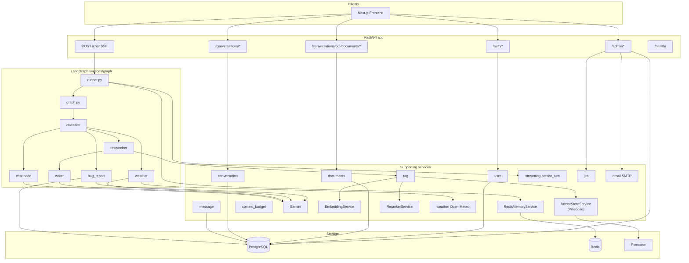
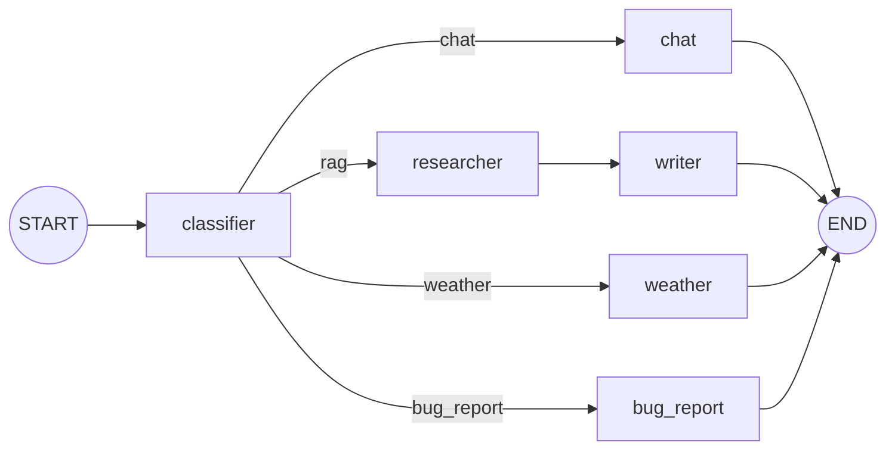
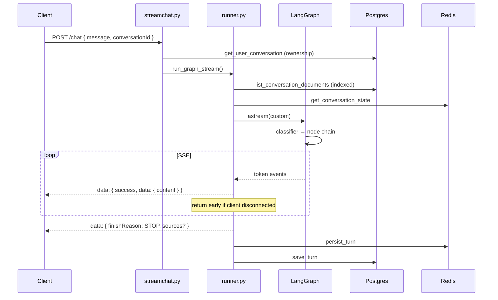
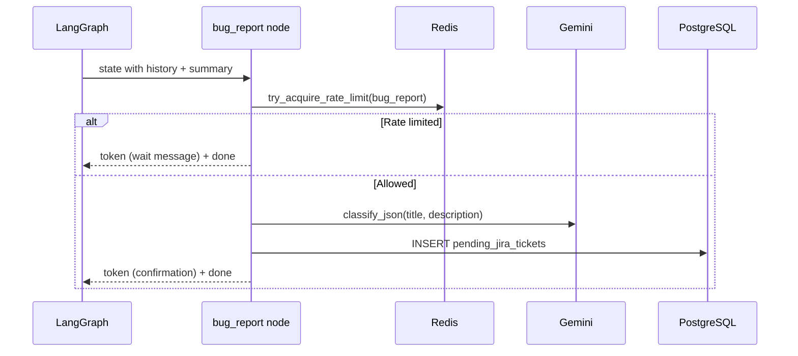
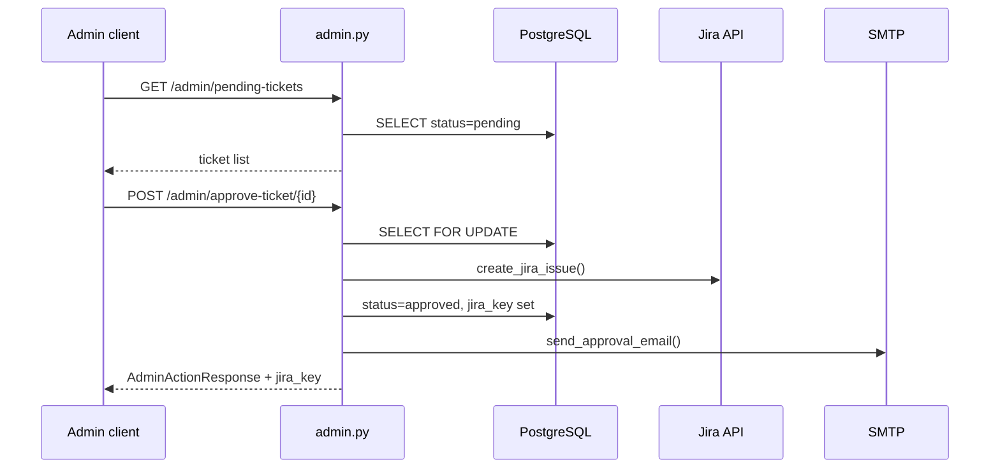
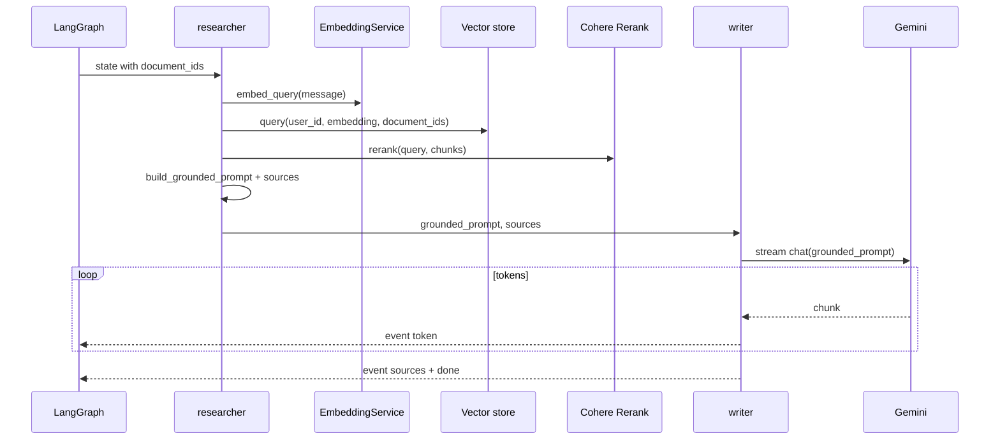
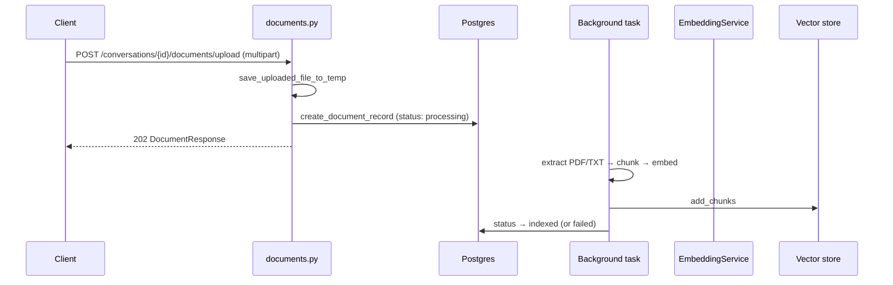
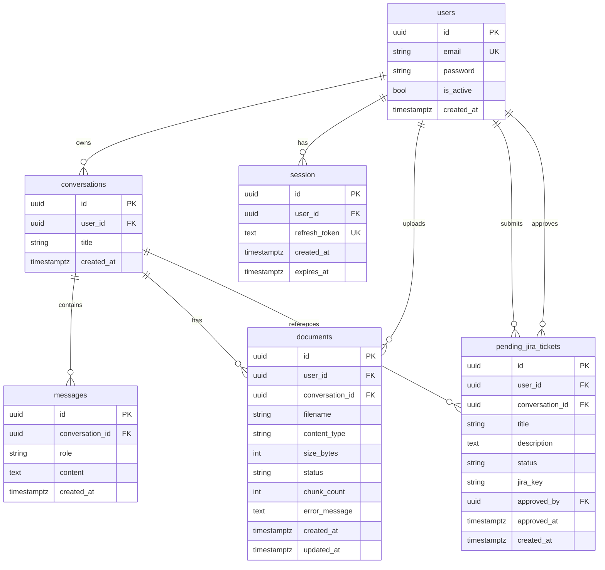

# Chatbot Backend

FastAPI service for the chatbot: JWT authentication with RBAC, Postgres-backed conversations, Redis hot context, **LangGraph intelligent routing** (chat / RAG / weather / bug report), conversation-scoped document RAG (**Pinecone** + embeddings + Cohere rerank), **Jira admin queue**, SMTP notifications, and Server-Sent Events (SSE) streaming.

The runnable application lives in [`app/`](./app/).

## Prerequisites

- **Python** 3.14+ (see `app/pyproject.toml`)
- **[uv](https://docs.astral.sh/uv/)** recommended for dependency management, or **pip** with a virtual environment
- **PostgreSQL**
- **Redis**
- **Google Gemini API key**
- **Cohere API key**
- **Jira Cloud** credentials (domain, email, API token, project key)
- **Embedding model** — local BGE-small ONNX model weights placed at `backend/app/models/onnx/baai-bge-small` (must contain `model.onnx` and `tokenizer.json`)
- **Pinecone API key** — required for vector storage indexing

## Install dependencies

Dependencies are declared in [`app/pyproject.toml`](./app/pyproject.toml) and locked in [`app/uv.lock`](./app/uv.lock). Run all commands from `backend/app/`.

### Option A — uv (recommended)

```bash
cd app
uv sync
```

Or run tools through uv without activating:

```bash
uv run alembic upgrade head
uv run fastapi dev main.py
```

### Option B — pip

```bash
cd app
python -m venv .venv
.venv\Scripts\activate        # Windows
pip install -e .
```

## Quick start

### 1. Environment

Create `app/.env` (loaded relative to `app/core/config.py`):

```env
# Auth
JWT_SECRET_KEY=change-me-to-a-long-random-secret

# Gemini
GEMINI_API=your-gemini-api-key

# Cohere (RAG reranking)
COHERE_API_KEY=your-cohere-api-key

# Redis
REDIS_URL=redis://localhost:6379/0

# Postgres
POSTGRESQL_USERNAME=postgres
POSTGRESQL_PASSWORD=postgres
POSTGRESQL_SERVER=localhost
POSTGRESQL_PORT=5432
POSTGRESQL_DATABASE=chatbot

# CORS (JSON array for pydantic-settings)
CORS_ORIGINS=["http://localhost:3000"]

# Jira (required for ticket approval)
JIRA_DOMAIN=https://your-org.atlassian.net
JIRA_EMAIL=you@example.com
JIRA_API_TOKEN=your-jira-api-token
JIRA_PROJECT_KEY=PROJ
JIRA_ISSUE_TYPE=Bug

# Bug report rate limit (seconds between submissions per user)
BUG_REPORT_RATE_LIMIT_SECONDS=300

# SMTP (optional — emails skipped when credentials empty)
SMTP_SERVER=smtp.gmail.com
SMTP_PORT=587
SMTP_USERNAME=
SMTP_PASSWORD=

# RAG / Pinecone
VECTOR_STORE_PROVIDER=pinecone
PINECONE_API=your-pinecone-api-key
PINECONE_INDEX_NAME=documents
RAG_INITIAL_TOP_K=20
RAG_TOP_K=5
RAG_RELEVANCE_THRESHOLD=0.4

# Optional
DOMAIN=localhost
ENVIRONMENT=local
ALLOW_PUBLIC_REGISTRATION=true
```

### 2. Database migrations

```bash
cd app
alembic upgrade head
```

Migration order:

| Revision | Creates / changes |
|----------|-------------------|
| `c4cd36485924` | `users`, `conversations` |
| `6090023d1049` | `session` (refresh token store) |
| `a1b2c3d4e5f6` | `messages` |
| `af7d28136461` | `roles`, `permissions`, join tables |
| `b7c8d9e0f1a2` | `documents` |
| `d8e9f0a1b2c3` | `documents.conversation_id` (FK, scoped RAG) |
| `9db8d2a36591` | `pending_jira_tickets` |
| `e2f4a6b8c0d1` | `conversation_id`, `jira_key`, `approved_by`, `approved_at` on pending tickets |

### 3. Seed roles and permissions

```bash
python seed.py
```

Creates the `admin` role (includes `ticket:manage`) and `users` role with scoped permissions. User seeding is commented out — register via `/auth/register`, then assign the `admin` role in the database for admin dashboard access.

### 4. Start the server

```bash
uv run fastapi dev main.py
```

Default URL: [http://localhost:8000](http://localhost:8000)

- Interactive API docs: [http://localhost:8000/docs](http://localhost:8000/docs)

The app fails fast on startup if Redis is unreachable. Gemini, Postgres, Cohere, and Jira are required when their respective code paths run. Pinecone is initialized as the vector store on startup.

### Docker

```bash
cd backend
docker build -f dockerfile -t chatbot-api .
docker run -p 8000:8000 --env-file app/.env chatbot-api
```

The multi-stage image uses Python 3.14-slim, installs dependencies with uv, and runs `uvicorn main:app` on port 8000.

## Features

- **LangGraph orchestrator** — Single `POST /chat` entry point; classifier routes to chat, RAG, weather, or bug_report nodes.
- **JWT auth** — Short-lived access tokens (15 min) and refresh tokens (7 days) with rotation on `/auth/refresh`.
- **httpOnly refresh cookies** — Refresh token stored in secure cookie; access token returned in JSON for client `localStorage`.
- **RBAC** — Roles and permissions tables; OAuth2 scopes enforced per endpoint (`ai:chat`, `ticket:manage`, etc.).
- **Refresh session store** — Refresh tokens hashed (SHA-256) in Postgres; old session deleted on rotation.
- **Conversation CRUD** — Per-user conversation rows with ownership checks on every access.
- **Dual memory** — Redis for fast Gemini context + rolling summary; Postgres for durable message history.
- **Cache hydration** — Cold Redis lists are seeded from Postgres before streaming.
- **Unified context compaction** — `compact_history` enforces token budget and `MAX_REDIS_MESSAGES`; evicted turns are summarized before removal.
- **SSE streaming** — Custom LangGraph stream events mapped to `text/event-stream` chunks.
- **Conversation-scoped RAG** — PDF/TXT upload per conversation; vector retrieval filtered by user + conversation document IDs.
- **Pinecone vector store** — `VectorStoreService` implemented via `PineconeVectorStoreService` (managed serverless) with per-user tenant isolation namespace.
- **Cohere reranking** — Initial vector hits reranked before grounded generation.
- **Weather tool** — Open-Meteo geocoding + forecast, city extraction from user message.
- **Bug report pipeline** — Gemini extracts ticket fields; pending row in Postgres; admin approve/reject with Jira + email.
- **Rate limiting** — Redis-backed per-user limits for bug reports (`BUG_REPORT_RATE_LIMIT_SECONDS`).
- **Client disconnect handling** — Skips `persist_turn` when the SSE client disconnects mid-stream.
- **Structured errors** — Application exceptions return `{ success: false, error: { code, message } }`.

## Architecture



## LangGraph design

### State (`services/graph/state.py`)

`AgentState` is a `TypedDict` passed between nodes:

| Field | Purpose |
|-------|---------|
| `user_id`, `conversation_id` | Ownership and scoping |
| `user_message` | Current user prompt |
| `has_documents`, `document_ids`, `document_filenames` | RAG availability for classifier and researcher |
| `history`, `context_summary` | Redis-backed conversation context |
| `route`, `route_reason` | Classifier output |
| `grounded_prompt`, `sources` | Researcher output for writer |
| `final_response` | Node completion (internal) |

### Graph topology (`services/graph/graph.py`)



Compiled at startup: `app.state.agent_graph = graph_builder()` in `main.py`.

### Classifier (`services/graph/classifier.py`)

1. **Rule-based fast path** — Regex lists `WEATHER_PATTERNS`, `BUG_PATTERNS`, and `RAG_PATTERNS` (only when `has_documents`).
2. **LLM fallback** — `gemini.classify_json()` with `RouteDecision` schema (`route`, `reason`).
3. **Guards** — `rag` downgraded to `chat` when no indexed documents exist.

### Nodes

| Node | File | Behavior |
|------|------|----------|
| **chat** | `nodes/chat.py` | `apply_token_budget` → stream `gemini.chat()` → emit `token` + `done` |
| **researcher** | `nodes/rag.py` | `retrieve_context` (embed, vector store, Cohere rerank) → `build_grounded_prompt` + `sources` |
| **writer** | `nodes/rag.py` | Stream grounded prompt via Gemini → emit `sources` then `done` |
| **weather** | `nodes/weather.py` | Extract city → `fetch_open_meteo` → stream Gemini answer grounded on API data |
| **bug_report** | `nodes/bug_report.py` | Rate-limit check → Gemini extracts title/description → insert `pending_jira_tickets` → stream confirmation |

Nodes use `get_stream_writer()` to emit custom events consumed by `runner.py`.

### Runner (`services/graph/runner.py`)

`run_graph_stream()` is the SSE generator for `POST /chat`:

1. **`prepare_context()`** — Load indexed documents for the conversation; hydrate Redis history + summary.
2. **`agent_graph.astream(initial_state, config, stream_mode="custom")`** — Pass services via `config["configurable"]` (`db`, `gemini`, `embedding_service`, `vector_store`, `reranker_service`, `memory_service`, `settings`).
3. **Map events to SSE:**
   - `token` → incremental `ChatStreamDelta.content`
   - `sources` → buffer for final chunk
   - `done` → capture `prepared_messages` and `context_summary` for persistence
4. **Final chunk** — `{ finishReason: "STOP", sources? }`
5. **`persist_turn()`** — Write compacted Redis state + Postgres messages (skipped on disconnect)

## API flows

### Unified chat (`POST /chat`)



### Bug report path (when classifier routes `bug_report`)



### Admin approve/reject (`/admin/*`)



Approval uses pessimistic row locking (`with_for_update`) and a `processing` intermediate status to prevent duplicate Jira issues. Rejection sets `status=rejected` and sends `send_rejection_email()`.

### RAG path (when classifier routes `rag`)



**Document scope:** `prepare_context()` loads all `indexed` documents for the conversation. The classifier and researcher use that list; the client does not pass `documentIds` on `/chat`.

### Weather path (when classifier routes `weather`)

1. Extract city from message via regex (`_extract_city`).
2. If missing → stream clarification prompt (no external API call).
3. `fetch_open_meteo(city)` — geocode then forecast via Open-Meteo.
4. Build a prompt with raw weather JSON; stream friendly Gemini reply.

### Document upload (async indexing)



## API reference

Unless noted, endpoints require `Authorization: Bearer <access_token>`.

### Health

| Method | Path | Description |
|--------|------|-------------|
| GET | `/health/` | Returns `{ health, redis }`; 503 if Redis ping fails |

### Auth (`/auth`)

| Method | Path | Request body / form | Response |
|--------|------|---------------------|----------|
| GET | `/me` | — | `UserMeResponse` (id, email, permissions) |
| POST | `/register` | `{ email, password }` (min 8) | `UserResponse` (201) |
| POST | `/login` | OAuth2 form: `username`, `password` | `Token` + refresh cookie |
| POST | `/refresh` | Refresh cookie | Rotated `Token` + new cookie |
| POST | `/logout` | Bearer + refresh cookie | `{ message }` |
| POST | `/clear-session` | Refresh cookie (optional) | Clears cookies |

### Conversations

| Method | Path | Description |
|--------|------|-------------|
| GET | `/conversations` | List conversations (newest first) |
| POST | `/conversations` | Create conversation `{ title? }` |
| GET | `/conversations/{conversation_id}` | Get one conversation (ownership check) |
| GET | `/conversations/{conversation_id}/messages` | Message history ordered by `created_at` |

### Documents (conversation-scoped)

| Method | Path | Description |
|--------|------|-------------|
| GET | `/conversations/{conversation_id}/documents` | List documents in this conversation |
| POST | `/conversations/{conversation_id}/documents/upload` | Upload PDF/TXT (202, async index) |
| DELETE | `/conversations/{conversation_id}/documents/{document_id}` | Delete document + vector chunks |

**Document response:**

```json
{
  "id": "...",
  "conversationId": "...",
  "filename": "report.pdf",
  "content_type": "application/pdf",
  "size_bytes": 1048576,
  "status": "indexed",
  "chunkCount": 42,
  "errorMessage": null,
  "created_at": "2026-06-11T12:00:00Z",
  "updated_at": "2026-06-11T12:00:05Z"
}
```

`status`: `processing` | `indexed` | `failed`

### Chat (SSE) — primary endpoint

| Method | Path | Content-Type | Description |
|--------|------|--------------|-------------|
| POST | `/chat` | `text/event-stream` | LangGraph-routed streaming reply |

**Request body:**

```json
{
  "message": "Tell me a short story.",
  "conversationId": "550e8400-e29b-41d4-a716-446655440000"
}
```

Requires OAuth2 scope `ai:chat`.

### Admin (`/admin`)

Requires OAuth2 scope `ticket:manage`.

| Method | Path | Description |
|--------|------|-------------|
| GET | `/admin/pending-tickets` | List tickets with `status=pending` |
| POST | `/admin/approve-ticket/{ticket_id}` | Create Jira issue, set `approved`, email user |
| POST | `/admin/reject-ticket/{ticket_id}` | Set `rejected`, email user |

**Pending ticket response:**

```json
{
  "id": "...",
  "user_id": "...",
  "user_email": "user@example.com",
  "title": "Upload button not working",
  "description": "Steps to reproduce…",
  "status": "pending",
  "created_at": "2026-06-11T12:00:00Z"
}
```

**Admin action response:**

```json
{
  "success": true,
  "message": "Ticket successfully approved and Jira issue created.",
  "jira_key": "PROJ-123"
}
```

### SSE event shape

Streaming chunk:

```json
{ "success": true, "data": { "content": "partial text", "finishReason": null } }
```

Final chunk (chat / weather / bug report):

```json
{ "success": true, "data": { "content": "", "finishReason": "STOP" } }
```

Final chunk (RAG — includes citations):

```json
{
  "success": true,
  "data": {
    "content": "",
    "finishReason": "STOP",
    "sources": [
      {
        "documentId": "...",
        "filename": "report.pdf",
        "page": 3,
        "chunkIndex": 12,
        "snippet": "...",
        "score": 0.82
      }
    ]
  }
}
```

Error chunk:

```json
{
  "success": false,
  "error": {
    "code": "STREAM_GENERATION_FAILED",
    "message": "Failed to generate a response. Please try again."
  }
}
```

## Database schema



- Passwords: bcrypt via `auth.security`.
- Refresh tokens in DB: SHA-256 hex digest, not the raw JWT.
- Deleting a conversation cascades to its messages and documents; `conversation_id` on tickets is `SET NULL`.
- Ticket `status`: `pending` | `processing` | `approved` | `rejected`

## Redis key format

| Key | Type | Purpose |
|-----|------|---------|
| `chat:user:{user_id}:conversation:{conversation_id}` | List | Compacted JSON message turns (max `MAX_REDIS_MESSAGES`) |
| `chat:user:{user_id}:conversation:{conversation_id}:summary` | String | Rolling summary from evicted turns |
| `rate_limit:bug_report:{user_id}` | String | Bug-report submission cooldown (TTL = `BUG_REPORT_RATE_LIMIT_SECONDS`) |

TTL: 86400 seconds (24 hours) on conversation keys; summary TTL refreshed on `set_conversation_state`.

**Hydration:** `get_conversation_state(db=..., gemini=...)` loads from Postgres when the history list is empty, runs `compact_history`, then writes via `set_conversation_state`.

## Project structure

```
backend/
├── dockerfile                # Multi-stage Python 3.14 image
└── app/
    ├── main.py                 # FastAPI app, lifespan, CORS, agent_graph init
    ├── alembic.ini
    ├── alembic/versions/       # Schema migrations
    ├── api/routes/
    │   ├── health.py
    │   ├── conversations.py
    │   ├── streamchat.py       # POST /chat SSE → run_graph_stream
    │   ├── documents.py        # Conversation-scoped document routes
    │   └── admin.py            # Pending ticket queue + approve/reject
    ├── auth/                   # JWT, bcrypt, refresh cookies, RBAC
    ├── core/                   # config, database, errors, logging
    ├── schemas/
    │   ├── models.py           # SQLAlchemy ORM (User, Document, PendingJiraTicket)
    │   ├── schema.py           # Conversation/message/admin Pydantic models
    │   ├── chat.py             # ChatRequest, SSE schemas
    │   └── rag.py              # DocumentResponse, sources
    └── services/
        ├── gemini.py           # Streaming chat + classify_json
        ├── memory.py           # Redis context + summary + rate limits
        ├── streaming.py        # persist_turn (compact + Redis + Postgres)
        ├── context_budget.py   # compact_history + apply_token_budget
        ├── conversation.py
        ├── message.py
        ├── user.py
        ├── documents.py        # Upload, extract, chunk, index
        ├── embeddings.py       # BGE query/document embeddings
        ├── rag.py              # retrieve_context, grounded prompt, sources
        ├── reranker.py         # Cohere AsyncClient rerank
        ├── weather.py          # Open-Meteo geocoding + forecast
        ├── jira.py             # Jira Cloud REST issue creation
        ├── email.py            # SMTP approval/rejection notifications
        ├── vector_store.py     # VectorStoreService ABC and Pinecone
        └── graph/
            ├── graph.py        # StateGraph builder + compile
            ├── state.py        # AgentState TypedDict
            ├── classifier.py   # Rule + LLM routing (4 routes)
            ├── runner.py       # prepare_context + SSE bridge
            ├── visualize.py    # Optional graph PNG export
            └── nodes/
                ├── chat.py
                ├── rag.py      # researcher + writer
                ├── weather.py
                └── bug_report.py
```

## Key modules

### `main.py` lifespan

On startup:

1. Connect `RedisMemoryService` and ping Redis.
2. Initialize `Gemini`, `EmbeddingService`, and `RerankerService`.
3. Initialize vector store using `PineconeVectorStoreService()` and run `await initialize()` (creates serverless index if missing).
4. Compile LangGraph: `app.state.agent_graph = graph_builder()`.

On shutdown: close Pinecone client, Cohere client, and Redis connection.

### `VectorStoreService` (`vector_store.py`)

Shared ABC consumed by `documents.py` and `rag.py`:

| Method | Purpose |
|--------|---------|
| `add_chunks` | Upsert embedded chunks after document indexing |
| `query` | Similarity search scoped by `user_id` and optional `document_ids` |
| `delete_document` | Remove all vectors for a document |

**`PineconeVectorStoreService`** — Native `AsyncPinecone` client. Index auto-provisioned on first startup (`ServerlessSpec`, AWS `us-east-1`). Vectors are namespaced by `str(user_id)`; `document_id` filters scope queries to a conversation's documents. Upsert batches of 100; scores are cosine similarity (0–1). Requires `await close()` on shutdown to release the aiohttp pool.

### `create_jira_issue` (`jira.py`)

Creates a Jira Cloud issue via REST API v3 with Atlassian Document Format body. Includes `user_id` and `conversation_id` in the description for traceability. Returns the issue key (e.g. `PROJ-123`).

### `send_approval_email` / `send_rejection_email` (`email.py`)

Async wrappers around synchronous SMTP (`smtplib`). Skips sending when `SMTP_USERNAME` or `SMTP_PASSWORD` is empty. Approval emails include a browse link built by `build_jira_browse_url()`.

### `bug_report` node (`nodes/bug_report.py`)

1. Acquire Redis rate-limit slot (`try_acquire_rate_limit`).
2. Build context from summary + recent turns + latest message.
3. Gemini `classify_json` → `BugReportInfo` (title, description).
4. Insert `PendingJiraTicket` with `status=pending`.
5. Stream confirmation tokens; release rate limit on extraction failure.

### `retrieve_context` (`rag.py`)

1. Short-circuit on empty `document_ids`.
2. Embed the user query; query the active vector store with `RAG_INITIAL_TOP_K`.
3. Rerank chunk texts with Cohere `rerank-english-v3.0`.
4. Deduplicate by parent chunk; return top `RAG_TOP_K` results.

### `persist_turn` (`streaming.py`)

After a successful stream (skip if empty model response or client disconnected):

1. Build `prepared_messages + [user, model]`.
2. `compact_history` — same engine as read-path budgeting.
3. `set_conversation_state` to Redis.
4. `save_turn` to Postgres (full durable log).

Stores the **raw** user message, not grounded prompts.

### `compact_history` / `apply_token_budget` (`context_budget.py`)

Single eviction path used at read time and write time. Triggers when estimated tokens exceed `SUMMARIZE_THRESHOLD` of the input limit, or message count exceeds `MAX_REDIS_MESSAGES`. Evicted pairs are summarized via Gemini. Token estimates use `tiktoken` (`cl100k_base`).

### RBAC and permissions

Seed data defines two roles:

| Role | Key permissions |
|------|-----------------|
| `admin` | All user/conversation/document/AI scopes + `ticket:manage` |
| `users` | Standard chat, document, and conversation scopes |

Permissions are embedded in JWT scopes at login and enforced via `Security(get_current_active_user, scopes=[...])`.

### Error handling

`UserBaseException` subclasses map to consistent JSON:

```json
{
  "success": false,
  "error": {
    "code": "NOT_FOUND",
    "message": "Conversation not found"
  }
}
```

## Environment variables

| Variable | Required | Default | Description |
|----------|----------|---------|-------------|
| `JWT_SECRET_KEY` | Yes | — | HS256 signing secret |
| `GEMINI_API` | Yes | — | Google Gemini API key |
| `COHERE_API_KEY` | Yes | — | Cohere API key for reranking |
| `REDIS_URL` | Yes | — | Redis connection URL |
| `POSTGRESQL_*` | Yes | — | Postgres connection |
| `JIRA_DOMAIN` | Yes | — | Jira Cloud base URL |
| `JIRA_EMAIL` | Yes | — | Jira API user email |
| `JIRA_API_TOKEN` | Yes | — | Jira API token |
| `JIRA_PROJECT_KEY` | Yes | — | Target project key |
| `JIRA_ISSUE_TYPE` | Yes | — | Issue type name (e.g. `Bug`) |
| `BUG_REPORT_RATE_LIMIT_SECONDS` | Yes | — | Cooldown between bug reports per user |
| `CORS_ORIGINS` | No | `[]` | Allowed browser origins (JSON list) |
| `SMTP_SERVER` | No | `smtp.gmail.com` | SMTP host |
| `SMTP_PORT` | No | `587` | SMTP port |
| `SMTP_USERNAME` | No | `""` | SMTP auth user (empty = skip email) |
| `SMTP_PASSWORD` | No | `""` | SMTP auth password |
| `ALLOW_PUBLIC_REGISTRATION` | No | `true` | Gate `/auth/register` |
| `VECTOR_STORE_PROVIDER` | No | `pinecone` | Vector store provider (strictly `pinecone`) |
| `PINECONE_API` | Yes | — | Pinecone API key |
| `PINECONE_INDEX_NAME` | No | `documents` | Pinecone index name |
| `RAG_INITIAL_TOP_K` | No | `20` | Vector candidates before rerank |
| `RAG_TOP_K` | No | `5` | Final chunks after rerank + dedupe |
| `RAG_RELEVANCE_THRESHOLD` | No | `0.4` | Minimum relevance (reserved for filtering) |
| `MAX_UPLOAD_BYTES` | No | `10485760` | Max upload size (10 MB) |
| `MAX_REDIS_MESSAGES` | No | `100` | Max messages in Redis working set |
| `MIN_RECENT_TURNS` | No | `4` | Minimum pairs kept during compaction |
| `MODEL_INPUT_TOKEN_LIMIT` | No | `1048576` | Gemini input window |
| `SUMMARIZE_THRESHOLD` | No | `0.8` | Fraction of input limit before eviction |
| `PARENT_CHUNK_SIZE_TOKENS` | No | `2000` | Parent chunk size for RAG |
| `PARENT_CHUNK_OVERLAP_TOKENS` | No | `100` | Parent chunk overlap |

## Tech stack

| Layer | Choice |
|-------|--------|
| Framework | FastAPI |
| Orchestration | LangGraph, LangChain Core |
| ORM | SQLAlchemy 2.x (async) + asyncpg |
| Migrations | Alembic |
| Cache | Redis (`redis.asyncio`) |
| Vector store | Pinecone (serverless), cosine, 384-dim |
| Embeddings | `onnxruntime` + `tokenizers` CPU-only inference (BGE-small ONNX) |
| Reranking | Cohere `rerank-english-v3.0` |
| AI | Google GenAI SDK (`gemini-3.1-flash-lite`) |
| Documents | PyMuPDF for PDF extraction |
| Weather | httpx + Open-Meteo APIs |
| Issue tracking | Jira Cloud REST API v3 |
| Email | smtplib (async via `run_in_threadpool`) |
| Token estimate | tiktoken (`cl100k_base`) |
| Auth | PyJWT + bcrypt + OAuth2 password flow + httpOnly cookies |
| Settings | pydantic-settings |

## Development notes

- **Working directory** — Run `fastapi dev` and `alembic` from `app/`.
- **Logs** — Application logger writes to `app/logs/fastapi.log`.
- **Conversation ownership** — Every conversation, message, and document endpoint validates `user_id`.
- **Scoped RAG** — Vector queries use conversation `document_ids` from `prepare_context()`, not client-supplied IDs on `/chat`.
- **Pinecone namespaces** — One namespace per `user_id`; document scoping uses metadata `document_id` filters.
- **Disconnect safety** — `run_graph_stream` checks `request.is_disconnected()` before persisting.
- **RAG sources** — Returned on the final SSE chunk only; not stored on `messages` rows.
- **Jira idempotency** — `approve_ticket` uses row locks and checks `jira_key` before creating duplicate issues.
- **Email graceful degradation** — Approval/rejection succeeds even when SMTP is unconfigured; response message notes email failure.

## Related documentation

- System overview and cross-stack flows: [`../README.md`](../README.md)
- Frontend client: [`../frontend/README.md`](../frontend/README.md)
