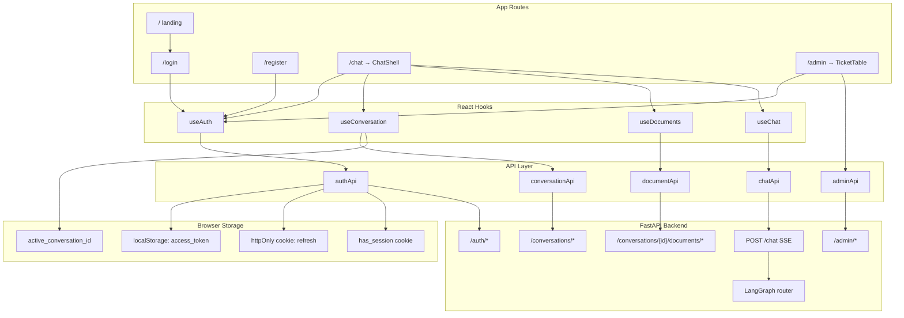
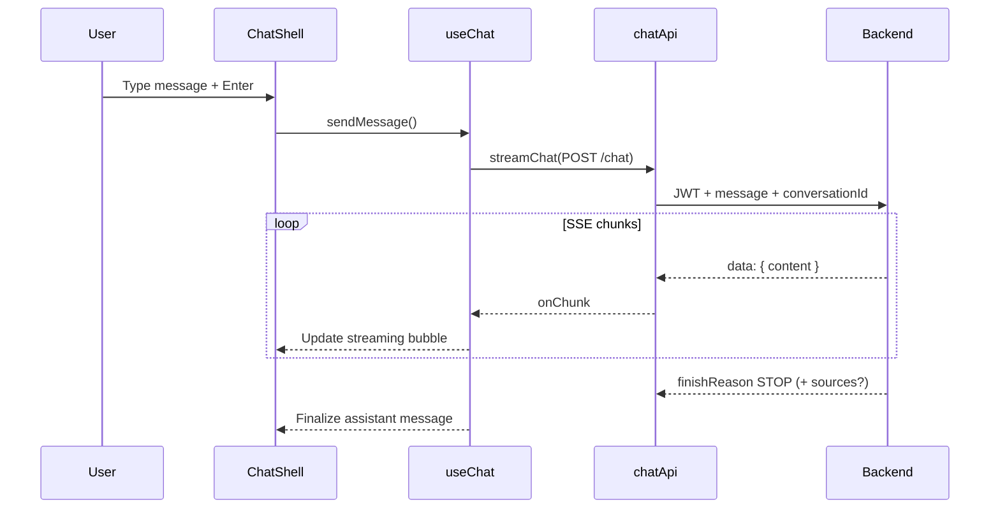

does# Chatbot Frontend

Next.js client for the chatbot: JWT-authenticated chat with **SSE streaming**, persistent conversations, **conversation-scoped document upload**, and an **admin dashboard** for Jira bug-report triage. All chat messages go to a single backend endpoint (`POST /chat`); the LangGraph router on the server decides whether to answer with general chat, document RAG, weather, or a bug report.

The runnable application lives in [`Chatbot/`](./Chatbot/).

## Prerequisites

- **Node.js** 18 or later
- **npm** (or yarn / pnpm / bun)
- **FastAPI backend** running locally (default `http://localhost:8000`)

Start the backend from `week-8/chatbot/backend/app/` before using the frontend.

## Quick start

```bash
cd Chatbot
npm install
```

Create `Chatbot/.env.local`:

```env
NEXT_PUBLIC_API_URL=http://localhost:8000
```

If unset, the app defaults to `http://localhost:8000`.

```bash
npm run dev
```

Open [http://localhost:3000](http://localhost:3000) for the public marketing landing page. Sign in at `/login` to access chat.

### Scripts

| Command | Description |
|---------|-------------|
| `npm run dev` | Start the Next.js dev server |
| `npm run build` | Production build and type-check |
| `npm run start` | Serve the production build |
| `npm run lint` | Run ESLint |

## Routes

| Path | Access | Description |
|------|--------|-------------|
| `/` | Public | Marketing landing (Hero, Features, Team, Testimonials, Pricing, FAQ) |
| `/login` | Public | Sign in with email and password |
| `/register` | Public | Create a new account |
| `/chat` | Protected | Main chat UI with conversation history sidebar and document panel |
| `/admin` | Protected (`ticket:manage`) | Admin dashboard for pending Jira bug reports |

### Route protection

Two layers guard authenticated routes:

1. **`proxy.ts`** — Edge middleware checks the `has_session` cookie and redirects unauthenticated visitors from `/chat` and `/admin` to `/login?redirect=…`.
2. **`useAuth` hook** — Client-side session verification via `GET /auth/me`, proactive token refresh, and optional `requiredPermission` checks (used on `/admin` for `ticket:manage`).

Protected chat routes redirect unauthenticated users to `/login`. The admin page additionally redirects users without `ticket:manage` to `/chat`.

## Features

- **Authentication** — Register, login, logout, and automatic access-token refresh with single-flight deduplication and httpOnly refresh cookies.
- **Hybrid session storage** — Access token in `localStorage`; refresh token in httpOnly cookie; `has_session` flag cookie for middleware.
- **Conversation management** — List, create, select, and resume past conversations; active conversation ID persisted in `localStorage`.
- **Unified streaming chat** — Every message uses `POST /chat`; backend LangGraph routes to chat, RAG, weather, or bug report automatically.
- **Conversation-scoped documents** — Upload PDF/TXT to the current conversation; each thread has its own document list.
- **Source citations** — When the backend routes to RAG, the final SSE chunk may include `sources`, rendered in `MessageBubble`.
- **Document indexing status** — Spinner + status text while uploading or indexing; polls every 3s until `status` is `indexed` or `failed`.
- **Admin ticket review** — SWR-powered table of pending bug reports with approve/reject modals and toast feedback.
- **Responsive UI** — Conversation sidebar (left), documents panel (right), slide-in drawers on mobile. Tailwind design tokens, focus rings, 44px minimum tap targets.
- **Dark mode** — Theme toggle via `next-themes` and `AnimatedThemeToggler` in the navbar.

There is **no client-side RAG toggle**. The header shows `N documents available · auto-routed` when indexed documents exist; routing is entirely server-side.

## Architecture



### Chat session data flow

1. On `/chat` mount, `useConversation` loads the conversation list and restores the last active conversation (from `localStorage`) or selects the most recent one.
2. `useDocuments` refreshes when `conversationId` changes; clears the list when no conversation is selected.
3. `useChat` fetches message history whenever `conversationId` or `conversationKey` changes.
4. Sending a message appends a user bubble and a streaming assistant placeholder, then consumes SSE chunks until `finishReason === "STOP"`.
5. If the final chunk includes `sources`, they attach to the assistant message and render in `MessageBubble`.
6. SSE error chunks and HTTP errors throw from `streamChat()`; `useChat` marks the assistant message as `error`.
7. Switching conversations aborts any in-flight stream and reloads history and documents for the new ID.
8. Chat input is disabled while documents are loading, uploading, or indexing.



### Admin dashboard flow

1. `useAuth({ requiredPermission: "ticket:manage" })` verifies the session and permission via `GET /auth/me`.
2. `useSWR` fetches `GET /admin/pending-tickets` with `adminFetcher` (wraps `authenticatedFetch`).
3. `TicketTable` renders pending rows; clicking a row opens `TicketDetailsModal`.
4. Approve/reject calls `adminApi.approveTicket()` or `rejectTicket()`, then `mutate()` refreshes the list.
5. Sonner toasts surface success or error messages from `AdminActionResponse`.

## Backend API (consumed by frontend)

All authenticated requests use `authenticatedFetch` from `lib/api/authApi.ts`, which attaches `Authorization: Bearer <access_token>`, sends `credentials: "include"` for refresh cookies, and retries once on `401` after refresh.

### Auth and user profile

| Method | Endpoint | Used by | Purpose |
|--------|----------|---------|---------|
| GET | `/auth/me` | `fetchCurrentUser()` | Current user ID, email, permissions |
| POST | `/auth/register` | `register()` | Create account |
| POST | `/auth/login` | `login()` | Issue access token + set refresh cookie |
| POST | `/auth/refresh` | `refreshTokens()` | Rotate refresh token (cookie-based) |
| POST | `/auth/logout` | `logout()` | Invalidate server session |
| POST | `/auth/clear-session` | `clearServerSession()` | Clear cookies without access token |

### Conversations

| Method | Endpoint | Used by | Purpose |
|--------|----------|---------|---------|
| GET | `/conversations` | `listConversations()` | List user conversations |
| POST | `/conversations` | `createConversation()` | Start new conversation |
| GET | `/conversations/{id}` | `getConversation()` | Fetch one conversation |
| GET | `/conversations/{id}/messages` | `getConversationMessages()` | Load chat history |

### Documents (conversation-scoped)

| Method | Endpoint | Used by | Purpose |
|--------|----------|---------|---------|
| GET | `/conversations/{id}/documents` | `listDocuments()` | List docs in this conversation |
| POST | `/conversations/{id}/documents/upload` | `uploadDocument()` | Upload PDF/TXT (202, async index) |
| DELETE | `/conversations/{id}/documents/{documentId}` | `deleteDocument()` | Remove doc + vector chunks |

### Streaming chat

| Method | Endpoint | Used by | Description |
|--------|----------|---------|-------------|
| POST | `/chat` | `streamChat()` | **Only** chat endpoint used by the client |

**Request body:**

```json
{
  "message": "What does the report say about revenue?",
  "conversationId": "550e8400-e29b-41d4-a716-446655440000"
}
```

The client does not send `documentIds`. The backend loads indexed documents for the conversation and the LangGraph classifier decides whether to use RAG.

### Admin (requires `ticket:manage` permission)

| Method | Endpoint | Used by | Purpose |
|--------|----------|---------|---------|
| GET | `/admin/pending-tickets` | `adminFetcher` (SWR) | List pending bug reports |
| POST | `/admin/approve-ticket/{id}` | `approveTicket()` | Create Jira issue + notify user |
| POST | `/admin/reject-ticket/{id}` | `rejectTicket()` | Reject + notify user |

### SSE payload shape

Each `data:` line in the stream is JSON matching `ChatStreamChunk`:

```ts
// Success chunk (streaming)
{ success: true, data: { content: "partial text", finishReason: null } }

// Stream complete (general chat, weather, or bug report)
{ success: true, data: { content: "", finishReason: "STOP" } }

// Stream complete (RAG) — includes citations when routed to researcher/writer
{
  success: true,
  data: {
    content: "",
    finishReason: "STOP",
    sources: [
      {
        documentId: "...",
        filename: "report.pdf",
        page: 3,
        chunkIndex: 12,
        snippet: "...",
        score: 0.82
      }
    ]
  }
}

// Error chunk — streamChat throws; useChat catch handles UI
{ success: false, error: { code: "...", message: "..." } }
```

HTTP errors before the stream starts are parsed with `parseApiError()` (same envelope as other API clients). Parsing is handled by `lib/stream/sseParser.ts`.

## Project structure

```
frontend/
└── Chatbot/
    ├── app/                    # Next.js App Router pages and layout
    │   ├── layout.tsx          # Root layout (Inter font, Sonner toasts)
    │   ├── page.tsx            # Marketing landing page
    │   ├── login/page.tsx
    │   ├── register/page.tsx
    │   ├── chat/page.tsx       # Auth-guarded chat shell
    │   └── admin/page.tsx      # Permission-guarded admin dashboard
    ├── components/
    │   ├── Form.tsx            # Shared login/register form
    │   ├── navbar.tsx          # Landing nav + theme toggle
    │   ├── Blocks/             # Marketing sections (Hero, Features, FAQ, etc.)
    │   ├── admin/
    │   │   ├── TicketTable.tsx
    │   │   └── TicketDetailsModal.tsx
    │   ├── ui/                 # shadcn-style primitives (Table, Badge, Dialog, …)
    │   └── chat/
    │       ├── ChatShell.tsx   # Layout: sidebars + header + messages + input
    │       ├── ConversationList.tsx
    │       ├── DocumentPanel.tsx
    │       ├── MessageList.tsx
    │       ├── MessageBubble.tsx   # Markdown + source citations
    │       ├── ChatInput.tsx       # Text input + paperclip upload
    │       ├── StreamingCursor.tsx
    │       └── EmptyState.tsx
    ├── hooks/
    │   ├── useAuth.ts          # Session guard + optional permission check
    │   ├── useConversation.ts  # List, select, create conversations
    │   ├── useDocuments.ts     # Per-conversation upload/list/delete
    │   ├── useChat.ts          # History load + SSE send/receive
    │   └── useAutoScroll.ts    # Scroll-to-bottom during streaming
    ├── lib/
    │   ├── api/
    │   │   ├── authApi.ts      # Auth, token refresh, authenticatedFetch
    │   │   ├── conversationApi.ts
    │   │   ├── documentApi.ts
    │   │   ├── chatApi.ts      # SSE streaming via POST /chat
    │   │   └── adminApi.ts     # Pending tickets + approve/reject
    │   ├── auth/
    │   │   ├── tokenStorage.ts # localStorage + has_session cookie
    │   │   └── conversationStorage.ts
    │   ├── stream/
    │   │   └── sseParser.ts
    │   ├── formatDate.ts
    │   └── utils.ts            # cn() Tailwind class helper
    ├── proxy.ts                # Edge route guard (has_session cookie)
    └── types/
        ├── chat.ts             # ChatMessage, ChatStreamChunk, SourceReference
        ├── conversation.ts
        └── document.ts         # RagDocument
```

## Key modules

### `chatApi.streamChat`

Posts to `POST /chat` with `{ message, conversationId }`, reads the response body as a `ReadableStream`, and parses SSE `data:` lines via `parseSSEBuffer`. Throws on `success: false` chunks or non-OK HTTP status.

### `useAuth`

- Verifies session via `fetchCurrentUser()` (`GET /auth/me`).
- Optional `requiredPermission` — redirects to `permissionDeniedRedirect` when missing.
- Used on `/chat` (basic auth) and `/admin` (`ticket:manage`).

### `useConversation`

- **`selectConversation(id)`** — Switches the active thread and persists its ID.
- **`startNewChat()`** — Creates a conversation via the API and prepends it to the list.
- On mount, restores `active_conversation_id` from `localStorage`, or falls back to the newest conversation.

### `useDocuments(conversationId)`

- Refreshes when `conversationId` changes; clears state when null.
- Polls every 3s while any document has `status === "processing"`.
- Upload requires an active conversation; otherwise sets a client-side error.
- Exposes `indexedDocumentIds` for potential UI use; routing does not depend on it.

### `useChat`

- Reloads history when `conversationId` or `conversationKey` changes.
- Maintains a separate `streamingAssistant` state for in-flight tokens.
- On `finishReason === "STOP"`, captures optional `sources` from the final chunk.
- Aborts the previous stream when the conversation changes or a new message is sent.
- Redirects to `/login` when the session is fully expired.

### `ChatShell`

Orchestrates layout: conversation sidebar, message area, document panel, and `ChatInput`. Header subtitle reflects indexed document count (`auto-routed`). Input is disabled during document processing.

### `authApi`

- Proactive refresh when the access token is within 60 seconds of expiry.
- Single shared `refreshPromise` to avoid concurrent refresh races.
- `credentials: "include"` on all auth calls for httpOnly refresh cookies.
- Clears tokens, session cookie, and active conversation ID on logout.

### `adminApi`

- `adminFetcher` — SWR-compatible GET wrapper with structured error messages for 401/403.
- `approveTicket` / `rejectTicket` — POST actions with `AdminActionResponse` parsing.
- `getAdminErrorMessage` — Maps `ApiRequestError` status codes to user-facing strings.

### `MessageBubble`

Renders assistant messages with `react-markdown` + `remark-gfm`, syntax highlighting for code blocks, and a collapsible sources section when `message.sources` is present.

### `tokenStorage`

- Persists access token and JWT expiry in `localStorage`.
- Sets/clears `has_session` cookie for `proxy.ts` middleware.
- Broadcasts auth changes across tabs via `BroadcastChannel`.

## Environment variables

| Variable | Required | Default | Description |
|----------|----------|---------|-------------|
| `NEXT_PUBLIC_API_URL` | No | `http://localhost:8000` | FastAPI backend base URL |

Client-side env vars must be prefixed with `NEXT_PUBLIC_` to be available in the browser.

## Tech stack

| Layer | Choice |
|-------|--------|
| Framework | Next.js 16 (App Router) |
| UI | React 19, Tailwind CSS 4, Framer Motion |
| Icons | Lucide React, React Icons |
| Markdown | `react-markdown`, `remark-gfm`, `react-syntax-highlighter` in `MessageBubble` |
| Data fetching | SWR (admin dashboard) |
| Toasts | Sonner |
| Themes | `next-themes`, `AnimatedThemeToggler` |
| Streaming | Fetch `ReadableStream` + custom SSE parser (`sseParser.ts`) |
| Components | Radix UI primitives, shadcn-style `components/ui/` |
| Text input | `react-textarea-autosize` |

## Development notes

- **Path alias** — `@/*` maps to the `Chatbot/` root (see `tsconfig.json`).
- **Strict Mode** — Conversation restore uses cancellation flags in effects to avoid stale updates.
- **New login session** — `login()` and `logout()` clear `active_conversation_id` so a fresh session does not inherit another user's last thread on a shared machine.
- **Admin access** — Requires the `ticket:manage` permission on the user (seeded on the `admin` role). Assign the role in the database after registration.
- **RAG sources** — Citations render during the live session but are not returned in `GET /messages`; they disappear on reload until backend persistence is added.
- **Production build** — Run `npm run build` from `Chatbot/` before deploying.

## Related documentation

- System overview and cross-stack flows: [`../README.md`](../README.md)
- Backend API, LangGraph, Jira integration, and services: [`../backend/README.md`](../backend/README.md)
